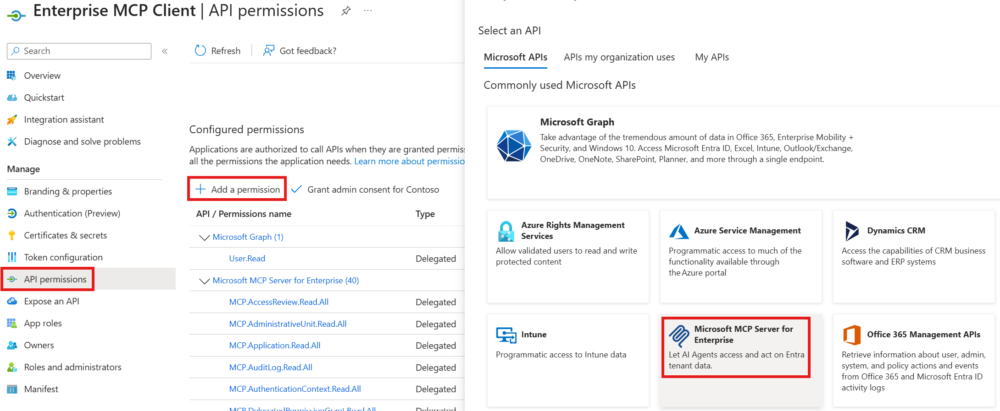
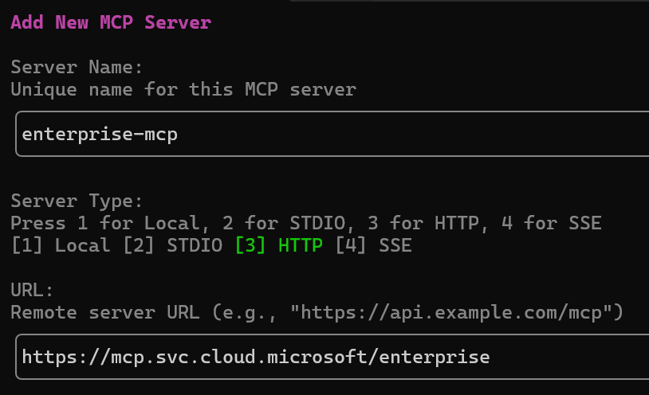

# Microsoft MCP Server for Enterprise


> ⚠️ If Visual Studio Code displays the error `Error getting token from server metadata: Error: Cannot force new registration for a non-dynamic authentication provider.`, change `"microsoft-authentication.implementation"` from `"msal"` to `"msal-no-broker"` in your Settings.

## Overview

Built on the open [Model Context Protocol](https://modelcontextprotocol.io), the public preview of **Microsoft MCP Server for Enterprise** lets AI agents access **Microsoft Entra** data by converting natural language queries into Microsoft Graph API calls.
Developers and IT administrators use it to query Microsoft Entra data from their AI-powered workflows.

Full Documentation: [Overview of Microsoft MCP Server for Enterprise](https://learn.microsoft.com/graph/mcp-server/overview)

## MCP Server Provisioning (execute once per tenant)

To set up the MCP Server for your tenant:

1. **Provision the MCP Server**.  In [Graph Explorer](https://developer.microsoft.com/graph/graph-explorer?request=servicePrincipals&method=POST&version=v1.0&GraphUrl=https://graph.microsoft.com&requestBody=InsgXCJhcHBJZFwiOiBcImU4Yzc3ZGMyLTY5YjMtNDNmNC1iYzUxLTMyMTNjOWQ5MTViNFwiIH0i), send:  
   `POST https://graph.microsoft.com/v1.0/servicePrincipals`  
   `Body: { "appId": "e8c77dc2-69b3-43f4-bc51-3213c9d915b4" }`

2. **[Register a new app](https://entra.microsoft.com/#view/Microsoft_AAD_RegisteredApps/CreateApplicationBlade/quickStartType~/null/isMSAApp~/false)**, representing the MCP Client.  
   Set the appropriate Redirect URI (also called Reply URL) depending on the client. For example:  
   **Claude Desktop** needs `https://claude.ai/api/mcp/auth_callback`,  
   **ChatGPT** generates a different one for each client using the format: `https://chatgpt.com/connector/oauth/<random_chars>`,  
   **Microsoft Foundry** generates a different Redirect URI for each connector using the format: `https://<random_chars>.<region>.azurecontainerapps.io/rest/oauth2-credential/callback`

   > Redirect URI type matters in Microsoft Entra. If you add the URI under **Web**, Entra treats the app as a **confidential client**. Use that for apps that run on a server and can protect credentials (like *Copilot Studio*). At sign-in, Entra expects that app to authenticate with a `client_secret` or a certificate-based `client_assertion`.  
   If you add the URI under **Mobile and desktop applications** or another public-client platform, Entra treats the app as a **public client**. Use that for desktop, CLI, or device apps that cannot keep a secret (like *ChatGPT* or *Claude*). These apps usually use the authorization code flow with PKCE instead of a client secret.

3. Associate the MCP permissions (`MCP.<Microsoft_Graph_Scope>`) between the MCP Server and the MCP Client  
   

### Info Table

| Property                   | Value                                                                   | Notes                               |
| -------------------------- | ----------------------------------------------------------------------- | ----------------------------------- |
| MCP Endpoint               | `https://mcp.svc.cloud.microsoft/enterprise`                            | Configure in your agent or mcp.json |
| MCP Server App Id          | `e8c77dc2-69b3-43f4-bc51-3213c9d915b4`                                  | Used for provisioning and telemetry |
| MCP Client App Id          | \< The one you registered in your tenant \>                             | Required to configure your agent    |
| Token URL                  | `https://login.microsoftonline.com/organizations/oauth2/v2.0/token`     | Required in some agents config      |
| Token endpoint auth method | `client_secret_post`                                                    | Required in some agents config      |
| Auth URL                   | `https://login.microsoftonline.com/organizations/oauth2/v2.0/authorize` | Required in some agents config      |
| Refresh URL                | `https://login.microsoftonline.com/organizations/oauth2/v2.0/token`     | Required in some agents config      |
| Scopes                     | `api://e8c77dc2-69b3-43f4-bc51-3213c9d915b4/.default`                   | Required in some agents config      |

## Tools

This MCP Server uses Retrieval-Augmented Generation (RAG) and few-shot prompting to generate complete Microsoft Graph queries rather than exposing a separate tool per Graph operation.  
It exposes three tools:

1. **`microsoft_graph_suggest_queries`**: Finds relevant Microsoft Graph API calls based on user intent.
1. **`microsoft_graph_get`**: Executes read-only Microsoft Graph API calls, respecting User roles and MCP Client scopes.
1. **`microsoft_graph_list_properties`**: Retrieves properties of specific Microsoft Graph entities to help the AI model

## Current scope and capabilities

For **Public Preview**, we support **read-only** enterprise IT scenarios in Microsoft Entra identity and directory operations (user, group, application, device management, and administrative actions).

The MCP Server handles queries such as:

1. **Security posture**: authentication methods/strengths, Conditional Access, Security Defaults.
1. **Privileged access**: Who has which directory roles, how assigned (direct vs group), and PIM status.
1. **Application risk**: Which Apps / Service Principals exist, who owns them, what permissions/SSO they use, and which are ownerless or external.
1. **Access governance**: Who has access to what (users, groups, packages); review decisions, automate joiner/mover/leaver.
1. **Device readiness**: Managed/compliant status, join state, OS/version distribution, and stale or inactive devices.
1. **Provenance and investigation**: End‑to‑end telemetry (sign‑in, audit, provisioning, network), health alerts, and SLA/availability.
1. **Optimize spending & hygiene**: License counts/usage, unused or stale apps/groups, domain configuration and contacts.

## Supported Clients and Configurations

The Microsoft MCP Server for Enterprise works with any MCP-compatible client that supports the latest standard.

> ⚠️ Notes:
>
> - Dynamic Client Registration (DCR) is not supported, but we are working to support OAuth Client ID Metadata Documents (CIMD) in a future release.
> - ChatGPT, Claude, and other 3P Agents require a **custom client Id**: register your own MCP Client application in your tenant, assign the required MCP.* scopes, and configure the redirect URIs accordingly.

### Microsoft Agent Platforms

- **[Copilot Studio](https://learn.microsoft.com/graph/mcp-server/use-enterprise-mcp-server-copilot-studio)**
- **[Microsoft Foundry](https://learn.microsoft.com/graph/mcp-server/use-enterprise-mcp-server-microsoft-foundry)**

### Third Party MCP clients

These clients require a custom MCP Client application registered in your tenant. See [Authorization and permissions](#authorization-and-permissions) to grant the required `MCP.*` scopes to your app.

<details>
<summary><b>ChatGPT</b></summary>

Go to **Settings**, **Apps**, **Create App**, and fill the dialog:


Put the App ID of the Registered app in the red box.

</details>

<details>
<summary><b>Claude</b></summary>

Go to **Customize**, **Connectors**, click "**+**", **Add Custom Connector**, and fill the dialog:


Put the App ID of the Registered app in the red box.

</details>

### Visual Studio Code and GitHub Copilot CLI

Visual Studio Code and GitHub Copilot CLI share the same Visual Studio Code MCP Client app Id, so they use the same setup.  
GitHub Copilot CLI can also use a custom client Id (see Option 2).

#### Prerequisites

These steps provision the Visual Studio Code MCP Client application in your tenant and grant it the MCP permissions.  
They're required for **Visual Studio Code** and for **GitHub Copilot CLI when it uses the default application Id** (Option 1 below). Skip them if you're configuring GitHub Copilot CLI with a custom `oauthClientId` instead (Option 2 below).

1. Install Microsoft.Entra.Beta PowerShell module (version 1.0.13 or later, *requires [PowerShell 7](https://learn.microsoft.com/powershell/scripting/install/install-powershell?view=powershell-7.6))*:

   ```powershell
   Install-Module Microsoft.Entra.Beta -Force -AllowClobber
   ```

1. Connect Microsoft Entra ID to your tenant:

   ```powershell
   Connect-Entra -Scopes 'Application.ReadWrite.All', 'DelegatedPermissionGrant.ReadWrite.All'
   ```

1. Grant all MCP permissions to the Visual Studio Code MCP Client app (also used by GitHub Copilot CLI when configured with the default application Id):

   ```powershell
   Grant-EntraBetaMCPServerPermission -ApplicationName VisualStudioCode
   ```

[Learn more](https://learn.microsoft.com/powershell/module/microsoft.entra.beta.applications/grant-entrabetamcpserverpermission?view=entra-powershell-beta) about `Grant-EntraBetaMCPServerPermission`. For detailed installation help, see the [installation instructions](https://learn.microsoft.com/powershell/entra-powershell/installation?view=entra-powershell-beta).

If the Microsoft Graph PowerShell SDK modules conflict with **Microsoft.Entra.Beta**, run the following and retry from step 1:

```powershell
Install-Module Uninstall-Graph
Uninstall-Graph -All
```

<details>
<summary><b>Visual Studio Code</b></summary>

1. Click [Install Microsoft MCP Server for Enterprise](https://vscode.dev/redirect/mcp/install?name=Microsoft%20MCP%20Server%20for%20Enterprise&config=%7b%22name%22:%22Microsoft%20MCP%20Server%20for%20Enterprise%22%2c%22type%22:%22http%22%2c%22url%22:%22https://mcp.svc.cloud.microsoft/enterprise%22%7d) to launch the MCP install page.
1. Click the Install button in VS Code and sign in with your account from the tenant above.
1. If Visual Studio Code displays the error `Error getting token from server metadata: Error: Cannot force new registration for a non-dynamic authentication provider.`, change `"microsoft-authentication.implementation"` from `"msal"` to `"msal-no-broker"` in your Settings.

</details>

<details>
<summary><b>GitHub Copilot CLI</b></summary>

GitHub Copilot CLI can connect using either the default Visual Studio Code MCP Client app Id or a custom MCP Client app Id you register in your tenant.

**Option 1. Default (uses the Visual Studio Code app Id)**

1. Complete the [Prerequisites](#prerequisites) above.
2. Add the MCP server to Copilot CLI. You can do this interactively with `/mcp add`:

   ```bash
   /mcp add
   ```

   

**Option 2. Custom MCP Client app Id**

1. Register your own MCP Client application in your tenant and grant it the required `MCP.*` scopes (see [Authorization and permissions](#authorization-and-permissions)).
1. Set `http://127.0.0.1:51001` as Redirect URI for "Mobile and desktop applications"
1. Specify your app Id via `oauthClientId` and `oauthPublicClient` to `true` in `~/.copilot/mcp-config.json`:

   ```json
   "mcp-enterprise": {
         "type": "http",
         "url": "https://mcp.svc.cloud.microsoft/enterprise",
         "headers": {},
         "tools": [ "*" ],
         "oauthClientId": "<REGISTERED_APP_CLIENT_ID>",
         "oauthPublicClient": true
       }
   ```

In either case, sign in with your account from the provisioned tenant when prompted.

For more information, see the [GitHub Copilot CLI documentation](https://docs.github.com/en/copilot/concepts/agents/about-copilot-cli).

</details>

## Authorization and permissions

The MCP Server for Enterprise uses Microsoft Graph API to access data in your Microsoft Entra tenant using **delegated permissions** only, and provides a reduced set of permissions exposed by Microsoft Graph.  
Use the following cmdlet to list the permissions provided by the MCP Server for Enterprise:

```powershell
(Get-EntraBetaServicePrincipal -Property "PublishedPermissionScopes" -Filter "AppId eq 'e8c77dc2-69b3-43f4-bc51-3213c9d915b4'").PublishedPermissionScopes | Where-Object { $_.IsEnabled -eq $true -and $_.AdditionalProperties["isPrivate"] -ne $true } | Select-Object Value, AdminConsentDisplayName | Sort-Object
```

If you'd like to use your own Registered Application, use the following cmdlets to to manage scopes granted to your MCP Client Application:

```powershell
Grant-EntraBetaMCPServerPermission -ApplicationId "<MCP_Client_Application_Id>" -Scopes "<Scope1>", "<Scope2>", "<...>"
Revoke-EntraBetaMCPServerPermission -ApplicationId "<MCP_Client_Application_Id>" -Scopes "<Scope1>", "<Scope2>", "<...>"
```

Learn more: [Manage MCP Server for Enterprise permissions](https://learn.microsoft.com/powershell/entra-powershell/how-to-manage-mcp-server-permissions)

## Advantages

1. **Remote MCP Server**: easy to configure and standards-compliant, deployed in the same regions as Microsoft Graph.
1. **IT Admins in control**: MCP clients need specific MCP.* scopes (mirroring Microsoft Graph scopes) to access your tenant data.
1. **Simplified architecture**: 3 tools cover the workflow instead of one tool per API operation.
1. **High-quality query generation**: generates accurate queries from over 500 real-world examples via RAG (Retrieval-Augmented Generation).
1. **Full auditability**: all MCP operations run under the same App ID with a specific user agent.
1. **No extra license required**: your existing Microsoft Entra and Microsoft Graph API licenses apply.

## Availability, Roadmap and feedback

The Microsoft MCP Server for Enterprise is available only in the public cloud (global service), with support for sovereign clouds planned for a future release.  
We will continue expanding beyond the current Microsoft Entra scenarios, but M365 APIs [will be covered by **Agent 365**](https://learn.microsoft.com/microsoft-agent-365/tooling-servers-overview).  
Support for write operations is planned for a future release.  
Please share suggestions or issues through our feedback form: [Submit feedback](https://aka.ms/MCPServerForEnterpriseSurvey).

## Licensing and usage

- The MCP Server for Enterprise **doesn't require extra cost or separate license**.
- You need the right licenses for the data you access (for example, Microsoft Entra ID Governance or Microsoft Entra ID P2 license for Privileged Identity Management (PIM) data).
- Any request to this MCP server is limited to **100 requests per minute per user**. Requests to `microsoft_graph_get` are also subject to [Microsoft Graph Throttling limits](https://learn.microsoft.com/graph/throttling-limits#identity-and-access-service-limits).

## Logs

To monitor usage, enable [Microsoft Graph activity logs](../microsoft-graph-activity-logs-overview.md) in your tenant. The system logs all API calls made through the MCP server.

**Filter for MCP Server usage:**

Use the Application (Client ID) of the Microsoft MCP Server for Enterprise: `e8c77dc2-69b3-43f4-bc51-3213c9d915b4`.

The following Kusto query retrieves these logs:

```kusto
MicrosoftGraphActivityLogs
| where TimeGenerated >= ago(30d)
| where AppId == "e8c77dc2-69b3-43f4-bc51-3213c9d915b4"
| project RequestId, TimeGenerated, UserId, RequestMethod, RequestUri, ResponseStatusCode
```

## Support and reference

For documentation, troubleshooting, and feedback, refer to the official [Microsoft Learn documentation](https://learn.microsoft.com/graph/mcp-server/overview) and support channels.

## Security and compliance

All operations respect Microsoft Graph permissions and security policies.
Ensure compliance with your organizational, regulatory, and contractual requirements when integrating the MCP Server.

## No warranty/limitation of liability

This software is provided "as is" without warranties or conditions of any kind, either express or implied. Microsoft isn't liable for any damages that result from use, misuse, or misconfiguration of this software.
